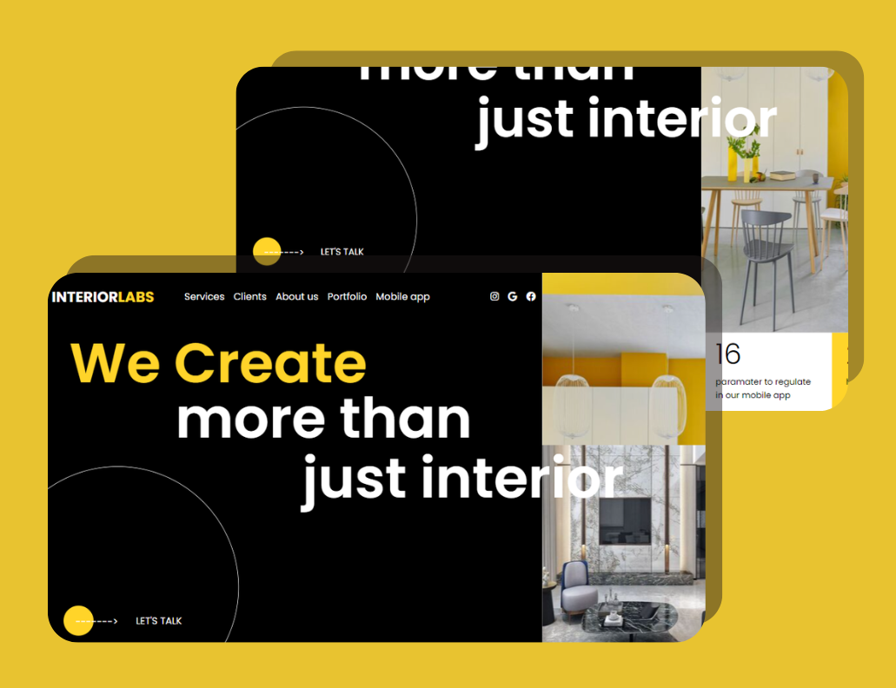

# Interior Labs Landing Page

Welcome to the Interior Labs Landing Page repository! This project showcases a stylish and modern landing page for an interior design company.




## Table of Contents

- [About](#about)
- [Demo](#demo)
- [Technologies Used](#technologies-used)
- [Features](#features)
- [Installation](#installation)
- [Usage](#usage)
- [Contributing](#contributing)

## About

Interior Labs Landing Page is a project created to demonstrate HTML, CSS, and JavaScript skills. The landing page offers an aesthetically pleasing design with various sections, including a hero section, services, philosophy, portfolio, and contact information.

## Demo

Provide a link to the live demo of the project or screenshots to showcase its appearance.

## Technologies Used

- HTML
- CSS
- JavaScript
- [Font Awesome](https://fontawesome.com/) - For icons
- [Google Fonts](https://fonts.google.com/) - For font styles
- [Owl Carousel 2](https://owlcarousel2.github.io/OwlCarousel2/) - For the image slider

## Features

- Responsive design for various devices
- Smooth scrolling navigation
- Hero section with a captivating call-to-action
- Services section to highlight offered services
- Philosophy section to share the company's principles
- Portfolio section to showcase project images
- Contact section with a "Let's Talk" CTA button

## Installation

1. Clone the repository:
```bash
git clone https://github.com/Bexst24/Interior_Labs.git```


## Usage

Open the `index.html` file in your web browser to view the landing page.

## Contributing

Contributions are welcome! If you find any issues or have ideas for improvements, please open an issue or submit a pull request.


